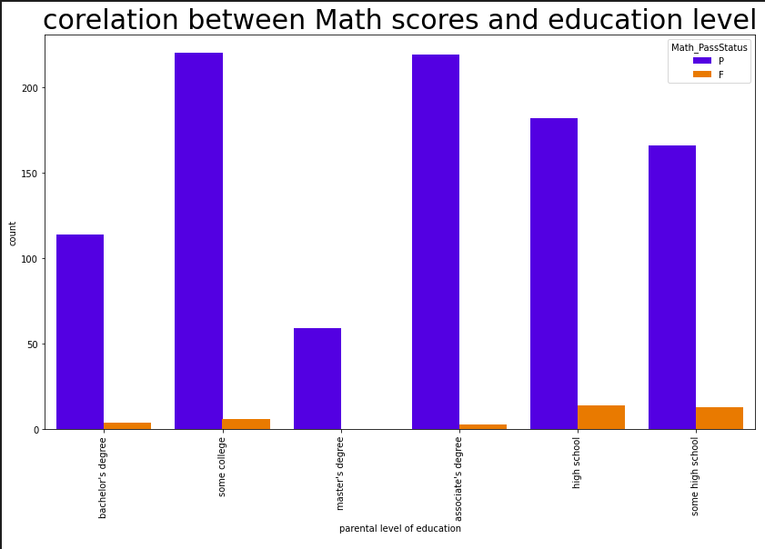
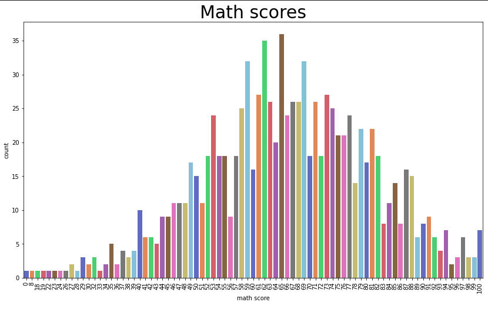
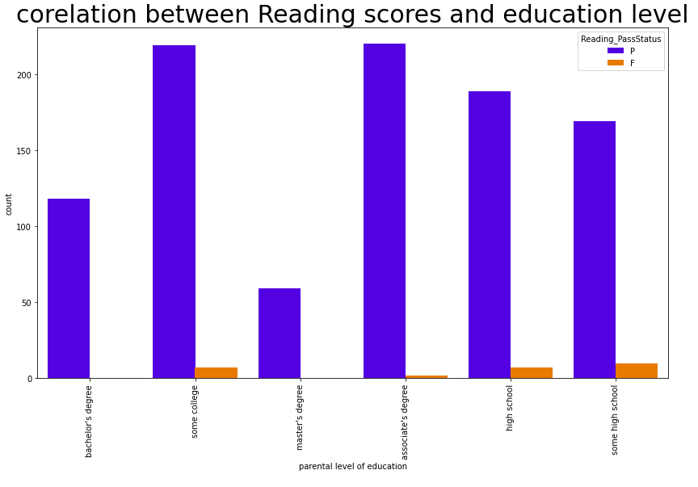
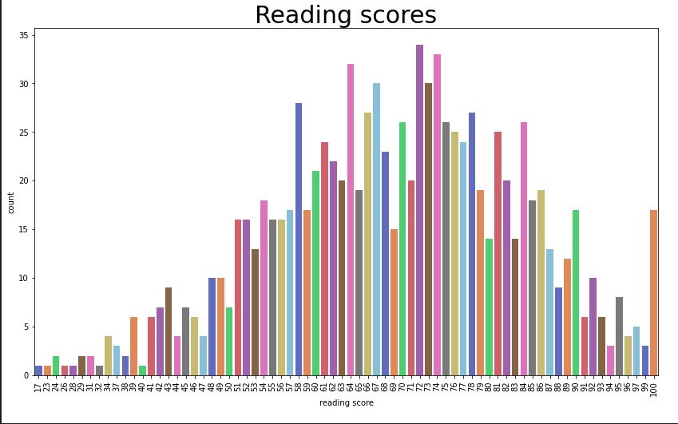
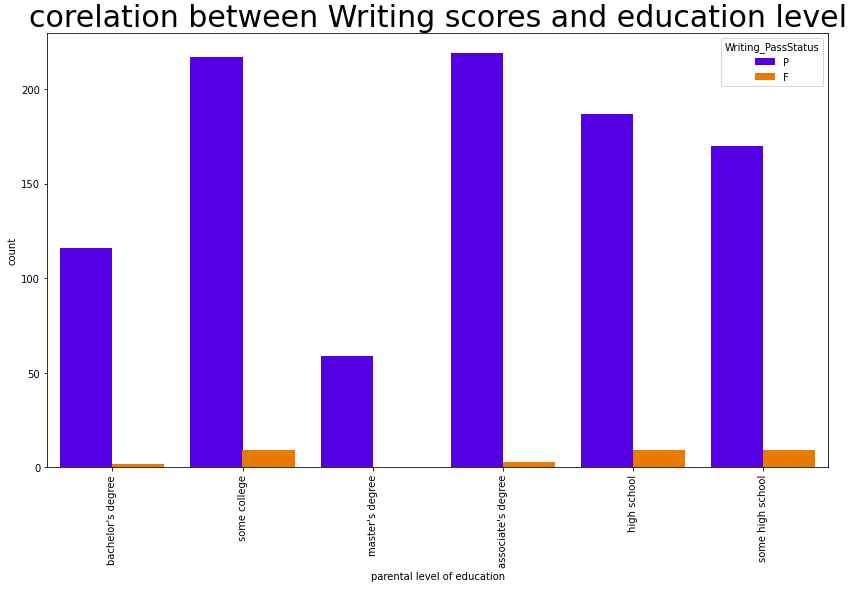
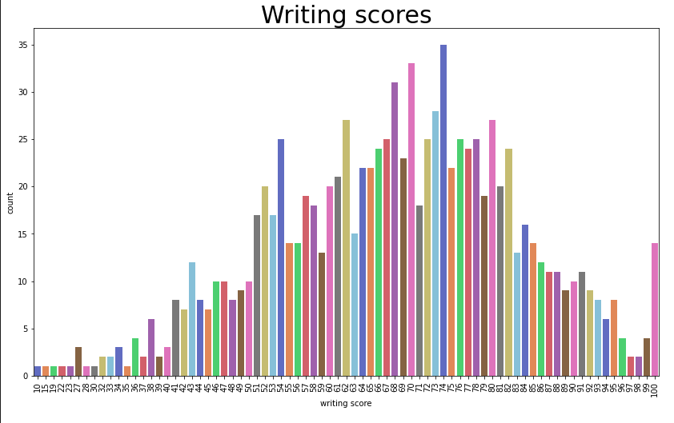
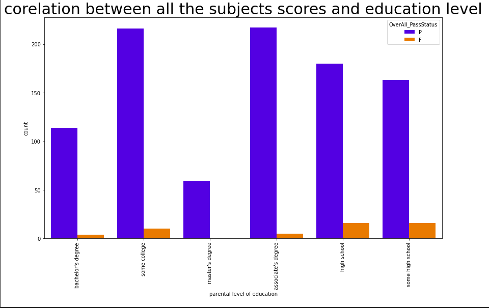
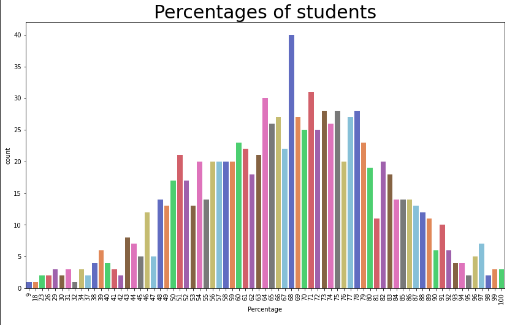
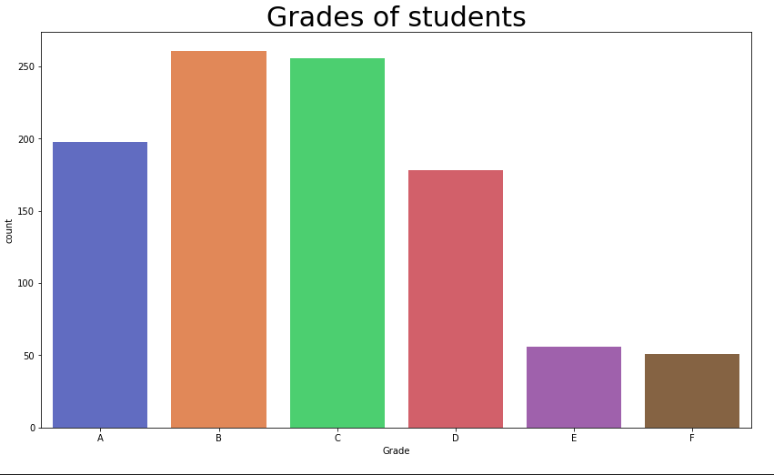
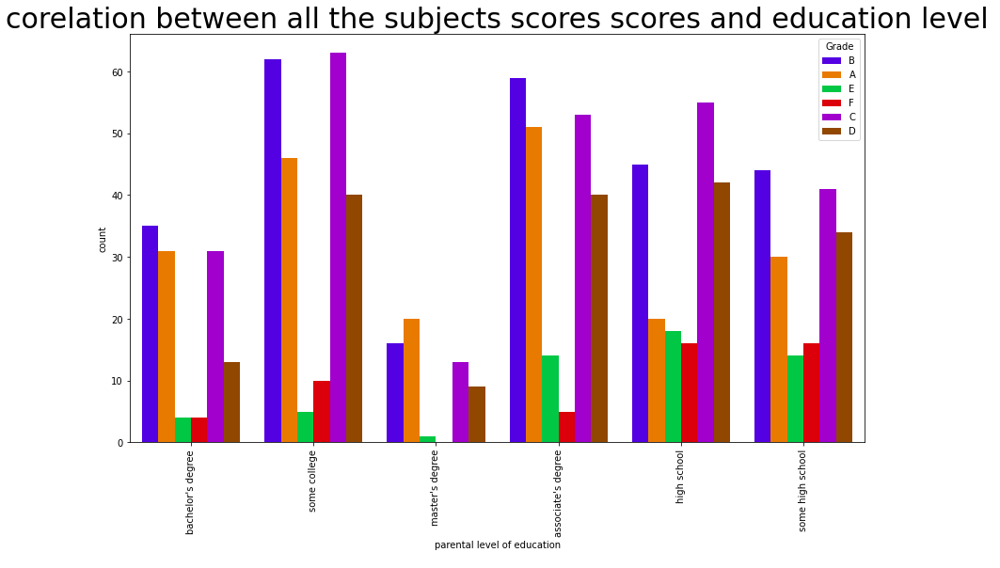

# Students performance in exams

# Aim
The aim of this project is to understand the various facts like economic, personal and social on the students performance.

# Inferences would be :
1. How to imporve the students performance in each test ?
2. What are the major factors influencing the test scores ?
3. Effectiveness of test preparation course?

# Contents
0. **Importing the libraries and the data.**

1. **Understanding the data.**

2. **Data analysis and visualization.**

    1. How many students passed in Math exam ? 

    
    

    2. How many studends passed in reading ? 

    
    

    3. How many students passed writing ?

    
    

    4. How many students passed in all the subjects ? 

    
    
    
    
    5. What are the grades of the students ?

    
    

3. **Preprocessing the data.**

    1. Removing unnecessary columns.

    2. Transform target categories into numbers.

    3. One hot encoding for categorical columns.

    4. Normalizing the continuous columns.

    5. Splitting the data.

4. **developing the machine learning models**

    1. Logistic regression.

    2. Decision tree.

    3. SVM.

    4. K-Nearest neighbors.

    5. Random forest

5. **Evaluating the model**

# Conclusion

the random forest model outperforms the other models in the prediction of the students grades with accuracy 91.5% .
